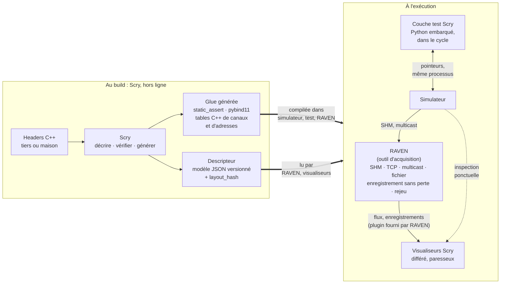

# Architecture : les briques et leurs responsabilités

Document d'analyse, **sans modification de code**. Il fait suite à
[ETUDE_SOURCES.md](ETUDE_SOURCES.md). En étudiant le réseau, le multicast,
l'enregistrement et le rejeu, on décrivait en fait un **autre outil**, plus
contraint (temps réel, débit, zéro perte), qui se servirait de Scry sans en
faire partie. Ce document sépare les deux et fixe ce que chaque brique fait,
ne fait pas, et ce qu'elles échangent.

---

## 1. Pourquoi la taille de la mémoire partagée compte

Mesure sur la machine de développement (`memcpy`, meilleur de plusieurs
essais, données hors cache) :

| Taille copiée | Durée | Débit |
|---|---|---|
| 4 Ko | 0,1 µs | 52 Go/s (tient en cache) |
| 1 Mo | 37 µs | 29 Go/s |
| **50 Mo** | **9,4 ms** | 5,6 Go/s (bande passante mémoire) |

Une station de travail récente fera peut-être 3 à 5 ms, mais l'ordre de
grandeur reste le même : **copier 50 Mo coûte une fraction importante d'un
cycle de 20 ms.** La taille décide de quatre choses :

| Ce qui dépend de la taille | Petit (Ko) | 50 Mo |
|---|---|---|
| **Coût d'un instantané** | négligeable | 5 à 10 ms, soit 25 à 50 % du cycle |
| **Cohérence par compteur de trame** | la copie tient largement entre deux cycles | si le simulateur calcule pendant 15 ms sur 20, il reste une fenêtre stable de 5 ms, plus courte que la copie : **la copie complète échoue presque toujours** |
| **Enregistrer chaque trame, brute** | quelques Mo/s | 2,5 Go/s, soit 9 To par heure : impossible sans sélection ni deltas |
| **Réseau** | trivial | 20 fois le débit d'un lien à 1 Gb/s |

Conséquence : avec 50 Mo, **on ne traite jamais la mémoire partagée comme un
bloc.** On la traite comme un ensemble de régions (canaux), dont on ne copie
que celles qui servent, ou dont on ne transmet que ce qui a changé.

À propos du compteur de trame que tu peux ajouter : c'est la bonne idée, à
condition de l'incrémenter **deux fois par cycle**. Impair au début du calcul,
pair à la fin, exactement comme le seqlock actuel de `scry_shm.h`. Un lecteur
qui copie une petite région réussit alors toujours entre deux cycles ; un
lecteur qui voit le compteur sauter de plus de 2 sait qu'il a manqué des
trames.

---

## 2. Deux axes qui décident de ce qui est possible

C'est bien un besoin, et c'est le principe de Scry : ne pas supposer qu'on peut
toucher au code. Mais ce sont deux axes indépendants, pas un seul :

|  | **Mémoire contiguë** (un bloc, régions à offsets fixes : une SHM, une struct racine) | **Mémoire dispersée** (variables globales, objets éparpillés dans le processus) |
|---|---|---|
| **Header modifiable** | Cas le plus favorable. On ajoute un compteur de trame, voire des compteurs ou des indicateurs de modification par région. La copie d'une région est cohérente, les deltas sont gratuits. | On peut regrouper, ou ajouter un compteur global. La collecte se fait par une table d'adresses générée par Scry. |
| **Header non modifiable** | On lit par offset, grâce au modèle. La cohérence repose sur une politique externe (double lecture, compteur existant, ou aucune garantie). | Seul un code **dans le processus** peut rassembler les données : les adresses n'ont de sens que là. Scry génère une table `{nom, &variable, sizeof, layout_hash}` que l'éditeur de liens résout, comme il le fait déjà pour les bindings Python. |

Ce que ça change concrètement :

- **Modifiable ou non** décide de la **cohérence** : peut-on ajouter un
  compteur, des indicateurs par région ? Sinon, il faut une politique externe.
- **Contiguë ou dispersée** décide de la **collecte** : une ou quelques copies
  de régions, ou une liste d'adresses à rassembler, forcément dans le
  processus.
- Dans tous les cas, **Scry fournit la description** : offsets pour une mémoire
  contiguë, table d'adresses générée pour une mémoire dispersée. C'est
  exactement son rôle de générateur de glue.

---

## 3. Deux sémantiques : l'état et le journal

Tu as raison : un enregistreur n'est pas un visualiseur, et la différence est
de nature.

| | **État** (visualiser) | **Journal** (enregistrer, rejouer) |
|---|---|---|
| Question | quelle est la valeur maintenant ? | que s'est-il passé à chaque cycle ? |
| Trame manquée | sans importance : la suivante la remplace | défaut : elle doit être détectée, comptée, signalée |
| Client lent | il voit moins de trames | la file grossit : il faut du débit garanti, ou perdre en le sachant |
| Synchronisation | aucune, lecture quand on veut | calée sur le cycle du producteur |
| Contrainte | faible | temps réel, débit, stockage |

**Enregistrer chaque trame d'une mémoire partagée depuis un autre processus
suppose d'être prévenu à chaque cycle.** Un lecteur qui interroge « de temps en
temps » manque des trames, et un compteur ne sert qu'à le savoir. Pour ne rien
perdre, deux voies :

- le simulateur **pousse** chaque trame (ou ses régions modifiées) dans une
  file circulaire en mémoire partagée, que l'enregistreur vide à son rythme ;
- ou il **signale** chaque fin de cycle (événement, sémaphore), et
  l'enregistreur copie les régions dans la fenêtre stable.

Dans les deux cas, avec 50 Mo, c'est le simulateur qui doit dire ce qui a
changé, ce qui renvoie au cas « header modifiable » du § 2.

### Le multicast

Le multicast n'existe qu'en UDP : tout ce qui a été dit du MTU s'applique
(fragmentation applicative, pas de retransmission). Pour l'enregistrer sans
perte **côté réception** : un fil dédié qui ne fait que lire et horodater, un
tampon de réception agrandi (`SO_RCVBUF`), aucun décodage dans ce fil. Les
pertes du réseau lui-même ne se rattrapent pas : l'enregistreur doit les
détecter (numéros de séquence) et les consigner. Si le trafic multicast a déjà
son propre protocole, le plus simple est un plugin qui enregistre les
datagrammes tels quels, comme une capture réseau, et les décode plus tard grâce
au modèle Scry.

---

## 4. Les briques

### Scry : décrire, vérifier, générer, visualiser en différé

| Fait | Ne fait pas |
|---|---|
| Parser les headers, produire le modèle (offsets, types, padding, héritage, commentaires, variables globales) | Tourner à côté du simulateur en production |
| Exporter le **descripteur** versionné (`scry json`) et le comparer (`scry diff`) | Garantir un débit ou une latence |
| Garantir l'ABI (`static_assert`, `scry verify`) | Enregistrer chaque trame |
| **Générer la glue** : bindings pybind11, tables C++ de canaux et d'adresses, gabarits pour d'autres systèmes C++ | Transporter des données sur le réseau à cadence |
| Visualiser pour comprendre et prévisualiser : `dump`, IHM, visualiseur natif, `watch` | Rejouer en temps réel |

Les visualiseurs lisent **à la demande et au mieux** : un instantané quand on
regarde, sans garantie de voir chaque trame. C'est suffisant pour comprendre un
layout, vérifier une valeur, prévisualiser.

### La couche test de Scry : piloter dans le cycle

| Fait | Ne fait pas |
|---|---|
| Exécuter des scénarios Python **dans** le processus, à chaque cycle, par pointeur | Lire depuis un autre processus ou le réseau |
| Positionner des entrées, vérifier des sorties, produire un rapport JUnit | Enregistrer ou rejouer un vol |

Elle consomme la glue pybind de Scry. Elle vit aujourd'hui dans `autotest/`,
déjà séparée du paquet ; elle pourra devenir un paquet à part si besoin.

### RAVEN, l'outil d'acquisition : le plan de données temps réel

**RAVEN** : *Record, Acquire, Verify, Export, Navigate*. Il capture tout,
sans perte, et rejoue.

| Fait | Ne fait pas |
|---|---|
| Acquérir : SHM contiguë ou collecte dispersée, TCP, multicast, fichier | Parser des headers : il n'a ni castxml ni pygccxml |
| Enregistrer **sans perte**, ou en signalant chaque perte | Décrire ou deviner un layout |
| Rejouer avec l'horloge d'origine, vitesse, navigation ; réinjecter si besoin | Connaître les types du projet autrement que par le descripteur généré |
| Tenir le débit : sélection, deltas, compression, contre-pression | |
| Afficher : IHM imgui en C++, paresseuse, construite depuis le descripteur | |
| Porter le **système de plugins** de sources (SHM, TCP, multicast, fichier, intermédiaire) | |

C'est lui qui porte l'essentiel de [ETUDE_SOURCES.md](ETUDE_SOURCES.md) : trame
commune, TCP ou UDP, gros volumes, contre-pression, format de rejeu. Ses
spécifications détaillées restent à écrire.

---

## 5. Le contrat entre les briques

Le point le plus important : **ce que les briques échangent, et dans quel sens.**

| Échange | Producteur | Consommateur | Forme |
|---|---|---|---|
| Descripteur | Scry | RAVEN, visualiseurs | modèle JSON versionné (`format`, `version`, plateforme, structures, `layout_hash`) |
| Glue générée | Scry | simulateur, couche test, RAVEN | sources C++ et bindings, compilés dans chaque binaire |
| Trames, enregistrements | RAVEN | RAVEN (rejeu, IHM) | format de fichier auto-descriptif : descripteur en tête, `layout_hash` par trame |

**Règle de dépendance** : RAVEN dépend de Scry **au build
seulement** (descripteur et glue). Scry ne dépend jamais de RAVEN et ne
connaît pas ses plugins : il vise seulement le contrat de données
`raven/descriptor.h`. Le visualiseur Python de Scry reste une preuve de
concept ; l'IHM de RAVEN est en C++. Le détail, avec du pseudo-code, est dans
[RAVEN_GLUE.md](RAVEN_GLUE.md).

**Garde-fou** : chaque trame et chaque enregistrement porte le `layout_hash`.
Un visualiseur ou RAVEN qui reçoit une empreinte différente
de celle de son descripteur refuse de décoder : c'est le même principe que les
`static_assert`, appliqué à l'exécution.

---

## 6. Ce que ça change pour l'existant

| Élément | Aujourd'hui | Proposition |
|---|---|---|
| `MemorySource` (Python) | interface interne | devient l'interface de plugin de source, minimale : lecture d'un instantané |
| `scry_shm.h`, `scry producer`, `scry watch` | canal SHM avec seqlock, producteur de démo | restent dans Scry comme **outils d'inspection** (au mieux, dernière valeur) ; à ne pas confondre avec un transport. Question ouverte : ce protocole devient-il le format SHM de RAVEN, ou reste-t-il une démo ? |
| Couche test (`autotest/`) | dans le dépôt Scry | reste dans le périmètre de Scry, distincte de RAVEN |
| Pistes B7 (rejeu) et C5 (réseau) du rapport | pistes pour Scry | relèvent de RAVEN |
| Nouvelle piste pour Scry | — | **générer la glue de RAVEN** : tables de canaux (région, offset, taille, empreinte) pour une mémoire contiguë, tables d'adresses pour une mémoire dispersée |

---

> Suite de l'analyse (SHM de pointeurs, rejeu à froid, réseau et
> intermédiaire) : [ETUDE_ACQUISITION.md](ETUDE_ACQUISITION.md).

## 7. À trancher

1. **Mémoire contiguë ou dispersée** dans ton simulateur ? Une SHM de 50 Mo
   pensée comme une struct racine, ou des variables réparties ?
2. **Qui signale la fin de cycle** à RAVEN : un compteur seul
   (on détecte les pertes), un événement (on les évite), ou une file
   circulaire alimentée par le simulateur ?
3. **Quelle part des 50 Mo change à chaque cycle** ? Elle décide si les deltas
   suffisent à tenir le débit d'enregistrement.
4. **Le multicast** a-t-il déjà son protocole (en-tête, séquence) ? Si oui,
   l'outil l'enregistre tel quel ; sinon, il adopte la trame commune.
5. **Le protocole SHM actuel de Scry** : format de RAVEN, ou
   simple démo d'inspection ?
