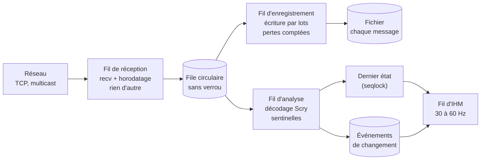
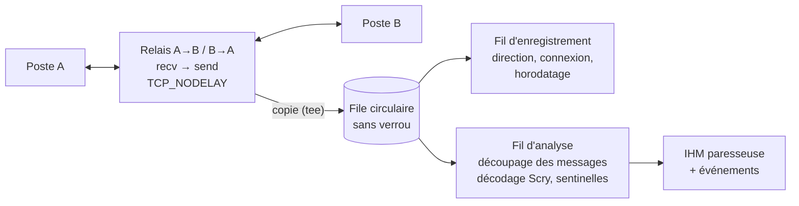

# Étude : RAVEN, l'outil d'acquisition — pointeurs, rejeu à froid, réseau

Document d'analyse, **sans modification de code**. Il complète
[ARCHITECTURE_BRIQUES.md](ARCHITECTURE_BRIQUES.md) sur quatre questions :
une SHM qui regroupe des pointeurs vers des zones dispersées, le rejeu d'un
enregistrement dans une nouvelle instance de l'application, la séparation de
l'enregistrement et de la visualisation sur le réseau, et l'enregistrement des
liaisons point à point par un intermédiaire (*man in the middle*).

Les volumes et les stratégies de réduction (sélection, deltas) sont
volontairement laissés pour plus tard.

---

## 1. Une SHM qui regroupe des pointeurs vers les zones dispersées

### Le point dur : un pointeur n'a de sens que dans son processus

L'idée est naturelle : une struct en SHM qui liste les zones à conserver.

```cpp
struct Catalogue {                 // dans la SHM
    std::uint64_t compteur;        // impair pendant le calcul, pair ensuite
    Etat*         etat;            // adresses dans le SIMULATEUR
    Capteurs*     capteurs;
    Moteur*       moteurs[4];
};
```

Mais **ces adresses appartiennent à l'espace d'adressage du simulateur.** Le
processus d'acquisition, qui mappe la même SHM, lit bien les valeurs des
pointeurs, mais il ne peut pas les suivre : à ces adresses, chez lui, il n'y
a rien, ou autre chose. La struct de pointeurs est donc une **table des
matières**, pas un accès. Quelqu'un doit encore aller chercher les octets. Il
y a trois façons de le faire, avec des conséquences très différentes :

| Où se fait le déréférencement | Comment | Coût pour le simulateur | Cohérence | Verdict |
|---|---|---|---|---|
| **A. Dans le simulateur** (collecteur en processus) | à chaque fin de cycle, une fonction parcourt la table et **copie** chaque zone dans la SHM, à la suite | une copie des zones, dans le cycle | parfaite : copie faite entre deux cycles, sous le compteur | **robuste, recommandé** |
| **B. Les zones vivent dans la SHM** | on alloue directement les objets dans la SHM (allocateur ou *placement new*), la table ne contient que des **offsets** | nul : pas de copie | celle du compteur de trame | **idéal quand on maîtrise l'allocation** |
| **C. Depuis l'autre processus** | l'acquisition lit la mémoire du simulateur par l'OS (`ReadProcessMemory` sous Windows, `process_vm_readv` sous Linux) aux adresses de la table | nul | aucune garantie : lecture pendant l'écriture ; un appel système par zone ; droits de débogage requis | **inspection au mieux, jamais pour l'enregistrement** |

### Conséquences sur l'architecture

- **A et B ramènent au cas contigu** du document précédent : une fois dans la
  SHM, tout est à un offset connu, RAVEN lit des régions et
  n'a jamais besoin d'un pointeur du simulateur.
- **Le collecteur de A est de la glue**, exactement la piste D5 : Scry connaît
  chaque type et sa taille, il peut générer la fonction de collecte
  (`{nom, &zone, sizeof, layout_hash}` → copie en SHM) et le **catalogue**
  qui décrit la SHM obtenue. Le simulateur appelle une seule fonction en fin
  de cycle.
- **Dans la SHM, ne jamais stocker de pointeurs, mais des offsets** (ou un
  identifiant de région et un offset). C'est ce qui rend la SHM lisible par
  n'importe quel processus, et, on le verra au § 2, l'enregistrement
  réutilisable.
- **Le signalement est libre côté SHM** : compteur de trame, plus un
  événement de fin de cycle (Windows `Event`, Linux `eventfd` ou futex).
  L'acquisition attend l'événement, copie ses régions dans la fenêtre stable,
  et le compteur lui dit si elle a manqué une trame.

---

## 2. Rejeu à froid dans une nouvelle instance

### Ton idée : repartir d'une nouvelle adresse de base

C'est la bonne base, et c'est ce que fait un chargeur d'exécutables :
**la relocation.** On enregistre des régions et leur contenu, jamais des
adresses absolues. Au rejeu, chaque région est retrouvée par son nom dans la
nouvelle instance, et Scry, qui décrit tout le reste, donne les offsets. Un
enregistrement fait lundi se rejoue mardi dans un autre processus.

Ce qui marche tel quel : **toutes les données qui ne sont pas des pointeurs**
(nombres, enums, tableaux, structs imbriquées, chaînes `char[N]`), soit la
grande majorité des interfaces de simulateur.

### Ce qui casse, et comment le traiter

Trois familles d'octets contiennent des adresses du run d'origine :

| Cas | Pourquoi ça casse | Traitement |
|---|---|---|
| **Pointeurs internes** (`Waypoint* suivant` qui pointe dans une autre région enregistrée) | l'adresse est celle du run d'origine | **table de correctifs** : l'enregistrement note la base d'origine de chaque région ; au rejeu, un pointeur `p` tombant dans `[base_origine, base_origine + taille)` devient `nouvelle_base + (p − base_origine)` |
| **Pointeurs vers l'extérieur** (tas, objets non enregistrés) | la cible n'existe pas dans l'enregistrement | mis à nul, ou champ exclu de la réinjection, et signalé |
| **Pointeurs cachés** : vtable (`vptr`), pointeurs de fonction, `std::vector`, `std::string`, `std::map` | l'ASLR déplace le code et le tas d'un run à l'autre ; les conteneurs pointent dans le tas | ne **jamais écraser** ces octets à la réinjection ; les conteneurs se sérialisent à part, ou s'excluent |

Scry sait déjà tout ce qu'il faut pour cela : quels membres sont des
pointeurs, vers quel type, lesquels sont polymorphes (`vptr` à l'offset 0),
lesquels sont des conteneurs de la STL. Il peut donc **générer la table de
correctifs et le masque d'exclusion** de chaque type. C'est le même principe
que les relocations d'un exécutable, appliqué aux données.

### La réinjection ne copie jamais une région entière

Au rejeu dans une application vivante, écrire la région complète écraserait
le `vptr`, les mutex, les pointeurs du tas et l'état interne. On réinjecte
**les champs d'entrée seulement**, champ par champ ou par intervalles
contigus que Scry calcule (offsets et tailles, en sautant les zones
exclues). Pour une relecture pure (visualiser un vol), la question ne se pose
pas : on ne fait que lire l'enregistrement.

### Une autre stratégie ?

| Stratégie | Pour | Contre |
|---|---|---|
| **Relocation par région** (ton idée, avec correctifs) | compact, rapide, octets bruts | dépend du layout : même `layout_hash` exigé au rejeu |
| Enregistrement logique, champ par champ (`chemin → valeur`) | survit à un changement de layout | beaucoup plus volumineux et plus lent à produire |
| Désactiver l'ASLR pour retrouver les mêmes adresses | aucun correctif | fragile, dépend de l'OS et de l'ordre d'allocation, à proscrire |

Recommandation : **la relocation par région**, avec le `layout_hash` dans
l'enregistrement. Si le layout a changé entre-temps, `scry diff` dit
exactement quoi, et une **conversion hors ligne** d'un layout à l'autre
(apparier les champs par chemin, comme le fait déjà `scry diff`) reste
possible. Le format logique n'est alors qu'un format de conversion, pas un
format d'enregistrement.

---

## 3. Réseau : enregistrer tout, visualiser au mieux, sans rien manquer

### Deux chemins séparés

Ton idée est la bonne : **le chemin d'enregistrement et le chemin de
visualisation ne doivent pas se partager le même fil.**

- **Enregistrement** : chaque message, dans l'ordre, horodaté à la réception.
  Aucun décodage. Si le disque ne suit pas, on le sait.
- **Visualisation au mieux** : la dernière valeur de chaque champ, affichée au
  rythme de l'écran (30 à 60 Hz). Un affichage lent ne ralentit rien.

### Ne pas rater un booléen qui ne vit qu'une trame : les sentinelles

Le défaut de la visualisation au mieux : un booléen qui passe à vrai pendant
une seule trame de 20 ms peut ne jamais être affiché. D'où les
**sentinelles** :

- l'utilisateur marque des champs à surveiller (un booléen, un entier, une
  phase de vol) ;
- un fil d'analyse, **à côté** du chemin d'enregistrement, compare à chaque
  message les octets de ces champs à leur valeur précédente (quelques octets à
  des offsets connus grâce à Scry : coût négligeable) ;
- chaque changement produit un **événement** `(horodatage, champ, ancienne
  valeur, nouvelle valeur)` dans une file ;
- l'IHM, même paresseuse, vide cette file : elle affiche l'historique des
  transitions, un indicateur « a changé » verrouillé jusqu'à acquittement, un
  compteur de fronts.

Variante « tout changement » sans liste de champs : comparaison page par page
de la trame avec la précédente, et un masque des pages modifiées. L'IHM ne
décode que ce qui a bougé.

### Schéma : un fil par rôle



Règles : le fil de réception ne décode ni n'affiche jamais ; les files entre
fils sont sans verrou (un producteur, un consommateur) ; seul le fil
d'enregistrement a le droit de « prendre du retard », et ses pertes
éventuelles sont comptées, jamais silencieuses.

---

## 4. L'intermédiaire (*man in the middle*) sur les liaisons point à point

### La stratégie est-elle correcte ?

**Oui, quand on ne peut pas faire autrement**, et c'est souvent le cas en
point à point : l'intermédiaire relaie chaque connexion par un port
intermédiaire, et voit passer tout le trafic. Ce qui fait ramer aujourd'hui
n'est pas le principe, c'est **tout faire dans le même fil** : relayer,
enregistrer, décoder et dessiner. Le moindre rafraîchissement d'écran retarde
le relais, donc la liaison elle-même.

Deux alternatives méritent d'être connues avant de s'engager :

| Approche | Pour | Contre |
|---|---|---|
| **Intermédiaire** (actuel) | fonctionne partout, voit les messages réassemblés | est **sur le chemin** : s'il rame, la liaison rame ; reconfiguration des ports |
| **Capture passive** (pcap / Npcap sur l'hôte, ou **port miroir** du commutateur) | hors du chemin : zéro latence ajoutée, zéro risque pour la liaison, aucune reconfiguration | il faut réassembler TCP à partir des paquets (bibliothèques existantes) ; droits de capture ; port miroir selon le matériel réseau |

Si un port miroir ou une capture sur l'hôte est possible, **c'est
préférable** : l'enregistreur ne peut plus dégrader ce qu'il observe. Sinon,
l'intermédiaire reste valable avec le bon modèle de fils.

### Le modèle de fils de l'intermédiaire



- **Le relais est le chemin critique** : un fil (ou une boucle
  d'événements `epoll`/IOCP) par connexion et par sens, qui ne fait que
  recevoir, envoyer, et déposer une copie dans la file. `TCP_NODELAY` des deux
  côtés, sinon Nagle ajoute des dizaines de millisecondes.
- **Le relais n'attend jamais l'enregistrement** : si la file est pleine, la
  copie est perdue pour l'enregistrement, comptée et signalée, mais la liaison
  continue. Une file dimensionnée largement (quelques secondes de trafic)
  rend ce cas exceptionnel.
- **Enregistrer le flux brut**, par sens et par connexion, horodaté à la
  réception. TCP ne donne pas de frontières de message : le découpage en
  messages se fait dans le fil d'analyse (en-têtes décrits par Scry), ou hors
  ligne. On garde ainsi un enregistrement fidèle même si le découpage a un
  défaut.
- **Latence ajoutée** attendue, une fois le relais isolé : de l'ordre de
  quelques dizaines de microsecondes, contre des millisecondes quand le relais
  partage son fil avec l'IHM.

---

## 5. Ce que ces choix impliquent pour les briques

| Brique | Conséquence |
|---|---|
| **Scry** | générer, en plus de la glue existante : le **collecteur** et le **catalogue** d'une SHM (§ 1), les **tables de correctifs de pointeurs et les masques d'exclusion** par type (§ 2), les **descripteurs de messages** pour le découpage réseau (§ 3, § 4) |
| **RAVEN** | un fil par rôle (réception, enregistrement, analyse, IHM) ; files sans verrou ; relocation au rejeu ; sentinelles ; enregistrement par région avec base d'origine et `layout_hash` |
| **Simulateur** | un appel en fin de cycle : collecte (ou rien si les zones vivent en SHM), compteur, événement |
| **Visualiseurs Scry** | lisent le dernier état et les événements via le plugin de source fourni par l'outil |

Aucune de ces conséquences ne demande de connaître dès maintenant la taille
finale des buffers : elles tiennent pour 1 Ko comme pour 50 Mo. La taille ne
décidera que des optimisations (sélection, deltas), prévues plus tard.
