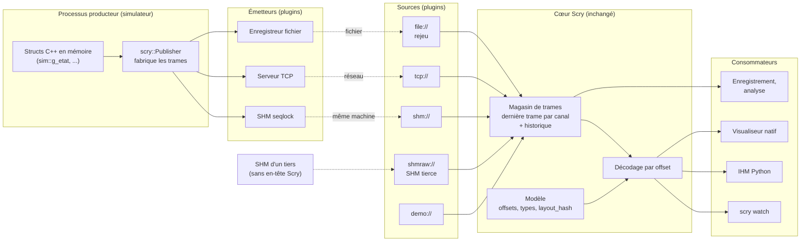
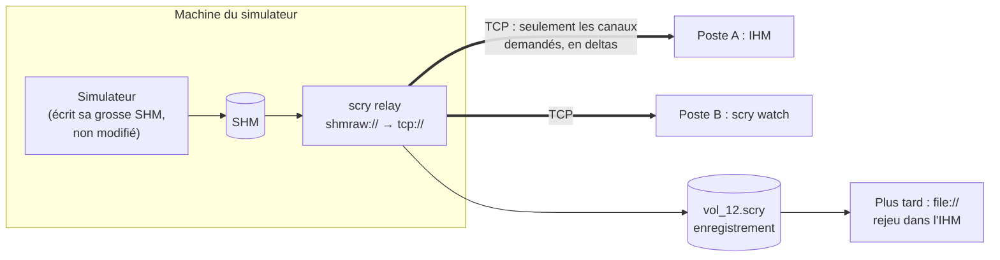

# Étude : des sources de données interchangeables (plugins)

Document d'analyse, **sans modification de code**. Question posée : les
octets que Scry décode peuvent venir d'une grosse mémoire partagée, du réseau,
d'un fichier de rejeu, et d'autres origines encore. Comment l'architecturer ?
Faut-il des plugins ? Que faire du fractionnement réseau et des gros volumes ?

---

## 1. Constat : l'origine des octets est câblée en dur, à trois endroits

| Endroit | Aujourd'hui |
|---|---|
| Python, `runtime/memory.py` | `MemorySource` avec `read(offset, size)` : **une amorce d'abstraction**, implémentée par `BufferSource` et `ShmChannelSource` |
| IHM Python, `ui/app.py` | trois boutons en dur : `MEMORY_NONE`, `MEMORY_DEMO`, `MEMORY_SHM` |
| Visualiseur C++, `viewer/scry_viewer.cpp` | `enum class Source { Instance, Demo, Shm }` et un `switch` |

Ajouter le réseau ou le rejeu, c'est aujourd'hui toucher les trois, et
recommencer pour chaque nouvelle origine. En revanche, **tout ce qui est en
aval ne dépend que d'une chose : des octets, un offset, le modèle.** Le
décodage (`decode`), les IHM et `scry watch` ignorent d'où viennent les
octets. C'est ce qui rend l'idée de plugin naturelle : la frontière existe
déjà, il faut la généraliser.

---

## 2. L'idée centrale : séparer quatre rôles

Ton intuition « plugin » est juste, mais le mot recouvre plusieurs choses.
Pour voir les boîtes, il faut séparer quatre rôles qui sont aujourd'hui mêlés :

| Rôle | Question à laquelle il répond | Exemples |
|---|---|---|
| **Producteur** | qui possède la mémoire C++ ? | le simulateur, `scry producer`, un rejeu |
| **Émetteur** (*sink*) | comment les octets quittent le producteur ? | segment SHM seqlock, serveur TCP, enregistreur fichier |
| **Source** | comment un consommateur récupère les octets ? | lecteur SHM, client TCP, lecteur de fichier, démo |
| **Consommateur** | que fait-on des octets ? | `scry watch`, IHM, visualiseur, analyse, enregistrement |

Et deux éléments partagés par tous :

- **la trame Scry** : un seul format pour un « instantané d'une structure »,
  identique en mémoire partagée, sur le réseau et dans un fichier ;
- **le modèle** : il donne le sens des octets (offsets, types). Il n'est pas un
  plugin, il est la référence commune.

**Les plugins sont les émetteurs et les sources.** Le reste ne change pas.

---

## 3. Schéma d'architecture

### Vue d'ensemble



### Le relais : une source branchée sur un émetteur

Un même processus peut lire d'un côté et réémettre de l'autre. C'est ce qui
répond au cas « grosse SHM sur la machine du simulateur, visualisation sur un
autre poste », sans toucher au simulateur :



### Ce qui n'est pas une source : le Python embarqué

Le Python embarqué (bindings pybind11) n'est **pas** dans ce schéma, et c'est
voulu. Il vit dans le processus du simulateur et touche la mémoire par
pointeur, sans trame ni copie. Les deux chemins se complètent :

| | Python embarqué | Sources et trames |
|---|---|---|
| Où | dans le processus du simulateur | dans un autre processus, un autre poste, ou plus tard |
| Accès | pointeur direct, lecture et écriture | copie cohérente, lecture seule par défaut |
| Coût | ~100 ns par accès | une copie par trame |
| Usage | piloter, tester dans le cycle | observer, enregistrer, rejouer |

Un script embarqué peut en revanche **être un producteur** : publier depuis le
cycle, via le même `Publisher`.

---

## 4. La trame Scry : un format, trois transports

La mémoire partagée a déjà un en-tête de 128 octets (`scry_shm.h`). On le
généralise en une trame commune :

| Champ | Taille | Rôle |
|---|---|---|
| `magic`, `version` | 4 + 2 | reconnaissance, évolution du format |
| `flags` | 2 | trame complète ou delta, compressée ou non |
| `channel_id` | 4 | quel canal (une instance d'une structure) |
| `sequence` | 8 | ordre, détection des pertes et des doublons |
| `timestamp_ns` | 8 | horloge du producteur : cadence du rejeu, courbes |
| `layout_hash` | 8 | empreinte FNV-1a du layout : refus d'un modèle différent |
| `payload_size` | 4 | taille de la charge qui suit |
| charge | *n* | octets bruts de la structure, ou delta |

Un **canal** est une instance d'une structure : `sim::g_etat`,
`sim::g_capteurs[3]`, ou une région d'une grosse SHM. Chaque source annonce
son **catalogue** (canaux, nom de type, taille, `layout_hash`), que le
consommateur rapproche du modèle, comme `scry watch` le fait déjà avec
`pick_struct`.

**Pourquoi un seul format.** Enregistrer, c'est écrire les trames reçues dans
un fichier. Rejouer, c'est relire ce fichier comme un flux réseau. Relayer,
c'est recopier des trames. Aucun transcodage, et un seul décodeur à tester.

---

## 5. Réseau : fractionnement, TCP ou UDP

### Ce que chaque protocole apporte vraiment

| | TCP | UDP |
|---|---|---|
| Fractionnement et réassemblage | **fournis** : flux d'octets découpé et recomposé par la pile, dans l'ordre | à la charge de l'application au-delà du MTU |
| Frontières de message | **aucune** : il faut délimiter les trames soi-même | un datagramme = un message |
| Pertes | retransmises | perdues |
| Taille d'un message | illimitée | 65 507 octets au plus (IPv4) |
| Latence sous perte | pic : le blocage en tête de file retarde tout ce qui suit | constante, la trame perdue est simplement absente |
| Traversée de routeurs, VPN | facile | souvent filtré |

Donc oui : **avec TCP, on hérite de la recomposition des paquets.** Une trame de
4 Mo part d'un bloc, la pile la découpe en segments de ~1460 octets (MSS) et
la recompose de l'autre côté. Mais TCP transporte un *flux*, pas des messages.
Il faut préfixer chaque trame par sa longueur (`u32 longueur` puis la trame)
pour savoir où elle s'arrête : c'est le *framing* applicatif, quelques lignes.

### Le MTU

| Couche | Taille utile |
|---|---|
| Ethernet (MTU standard) | 1500 octets |
| moins en-têtes IPv4 (20) et UDP (8) | **1472 octets** de charge par datagramme sans fragmentation |
| TCP (MSS typique) | 1460 octets par segment, invisible pour l'application |
| Jumbo frames (si tout le réseau les accepte) | ~9000 octets |

En UDP, un datagramme plus gros que 1472 octets est fragmenté par IP. **Il
suffit d'un fragment perdu pour perdre tout le datagramme**, et beaucoup de
réseaux filtrent les fragments. Il faut donc découper soi-même : trame coupée
en morceaux de ~1400 octets, chacun portant `(sequence, index, nombre)`, et
réassemblage côté lecteur avec délai d'expiration. Une trame incomplète est
jetée, et c'est acceptable en télémétrie : la suivante arrive dans 20 ms.

### Recommandation

1. **TCP d'abord**, avec longueur en préfixe, `TCP_NODELAY` (pas de Nagle) et
   une **politique « dernière valeur »** côté émetteur (voir § 7). Simple,
   fiable, gère les grosses trames, traverse tout.
2. **UDP ensuite, en option**, pour un réseau local où la latence compte plus
   que la complétude : découpage applicatif sous le MTU, trames incomplètes
   jetées. Éventuellement en multicast pour servir plusieurs postes sans
   multiplier le débit.

On peut aussi combiner : **TCP pour le contrôle** (catalogue, abonnements,
modèle) **et UDP pour les données**. C'est le schéma classique des flux
temps réel, mais inutile tant que TCP suffit.

---

## 6. Grosses données

### L'ordre de grandeur décide

| Cas | Débit à 50 Hz | Réaliste en Ethernet 1 Gb/s (~110 Mo/s utiles) ? |
|---|---|---|
| Une struct de 4 Ko | 200 Ko/s | oui, trivial |
| 200 structs de 4 Ko | 40 Mo/s | oui, à surveiller |
| Une SHM de 50 Mo recopiée entière | 2,5 Go/s | **non**, vingt fois trop |

Envoyer une grosse SHM en entière à chaque cycle est impossible. Quatre
leviers, par ordre d'efficacité :

1. **Abonnement.** Le consommateur ne demande que les canaux qu'il affiche ou
   enregistre. L'IHM qui montre trois structs n'en reçoit que trois. C'est le
   levier majeur, et il suppose un canal de contrôle (TCP) où le client
   annonce ce qu'il veut.
2. **Deltas.** La charge est découpée en pages (par exemple 4 Ko). Seules les
   pages modifiées depuis la dernière trame partent, avec un masque de bits.
   Une **trame complète périodique** (« trame clé », toutes les secondes par
   exemple) permet à un client qui arrive ou qui a perdu une trame de repartir.
3. **Décimation par canal.** 50 Hz pour les commandes de vol, 1 Hz pour la
   configuration.
4. **Compression** (LZ4, très rapide) : utile sur des données peu entropiques
   (zéros, padding), en complément des deltas, pas à leur place.

### Le cas de la grosse SHM écrite par un tiers

C'est le cas le plus délicat, et probablement le tien : le simulateur écrit sa
propre SHM, sans en-tête Scry ni seqlock.

- **Où sont les structures ?** Si la SHM est elle-même décrite par une struct
  dans un header (`struct BlocPartage { Etat etat; Capteurs capteurs[16]; ... }`),
  le modèle Scry donne déjà l'offset de chaque partie. Chaque membre devient un
  canal, sans fichier de correspondance à écrire. Sinon, une table déclarée
  dans la configuration : `canal = type @ offset`.
- **Cohérence ?** Sans seqlock, une lecture peut être déchirée. Trois
  politiques au choix, par canal :
  - **aucune** : suffisant pour afficher ;
  - **double lecture** : copier deux fois et comparer, recommencer si
    différent ; coût ×2, ne garantit rien si l'écrivain est plus rapide ;
  - **compteur de l'application** : si la struct a déjà un compteur de trame
    (`frame_counter`), s'en servir comme séquence de seqlock
    (`seq_field = sim::BlocPartage.frame_counter`). C'est souvent le cas dans
    les simulateurs, et c'est gratuit.
- **Coût de copie** : ne copier que les régions abonnées, jamais les 50 Mo.

---

## 7. Qui attend qui : la contre-pression

C'est le point qui fait échouer ces architectures en pratique. **Le simulateur
ne doit jamais attendre un consommateur.** Chaque émetteur a donc une
politique explicite :

| Émetteur | Politique | Pourquoi |
|---|---|---|
| SHM seqlock | écrase, l'écrivain n'attend jamais | déjà le cas |
| TCP vers une IHM | **dernière valeur** : une boîte aux lettres par canal, un fil d'envoi ; si la trame précédente n'est pas partie, elle est remplacée | un client lent voit moins de trames, jamais de retard qui s'accumule |
| Fichier d'enregistrement | **tout garder** : file d'attente et fil d'écriture ; si le disque ne suit pas, compter les trames perdues et le signaler | un enregistrement troué doit se savoir |

L'envoi TCP ne se fait jamais dans le fil du simulateur : `Publisher::publish`
dépose la trame et rend la main, comme aujourd'hui en SHM.

---

## 8. Le fichier de rejeu

Il découle du format de trame :

```
[en-tête de fichier]  magic, version, plateforme, modèle JSON complet (scry json)
[trame][trame][trame] ...  les trames telles que reçues, longueur en préfixe
[index]               toutes les N secondes : position des trames clés, pour la navigation
```

Deux choix qui comptent :

- **Le modèle est embarqué dans le fichier.** Un vol enregistré aujourd'hui se
  relit dans deux ans, après trois livraisons du header, sans retrouver la
  bonne version. Même idée pour le réseau : le serveur peut envoyer son modèle
  au client, qui n'a alors besoin ni du header ni de castxml.
- **Une source rejouable a une horloge.** Lecture, pause, vitesse ×2, saut
  temporel via l'index. Les consommateurs l'ignorent : ils voient passer des
  trames comme en direct. L'IHM peut ajouter une barre de temps quand la
  source se déclare « navigable ».

Le rejeu vers le simulateur (réinjecter des entrées enregistrées) est un autre
usage. Il passe par un émetteur vers la SHM ou par un script embarqué, pas par
une source.

---

## 9. Le mécanisme de plugin

### Côté Python

- **Sélection par URI.** Une option commune à `watch`, `ui`, `record` :
  `--source tcp://sim-pc:5555`, `shm://scry_demo`,
  `shmraw://BlocSim?type=sim::BlocPartage`, `file://vols/vol_12.scry?speed=2`,
  `demo://`.
- **Découverte par points d'entrée** (`importlib.metadata`, groupe
  `scry.sources`). Le schéma de l'URI choisit le plugin. Un plugin interne
  (protocole propriétaire, bus avionique, ARINC, DDS…) se livre comme un
  paquet pip séparé, sans modifier Scry.
- **Interface minimale** :

```python
class Source(Protocol):
    scheme: str                                     # "tcp", "shm", "file"...
    def open(self, uri: str) -> Catalog: ...        # canaux annoncés
    def subscribe(self, channels: list[int]) -> None: ...
    def poll(self) -> list[Frame]: ...              # non bloquant : trames arrivées
    def close(self) -> None: ...
    capabilities: set[str]                          # {"live"}, {"seekable"}, {"writable"}
```

  Le magasin de trames garde la dernière trame complète par canal et applique
  les deltas. Un adaptateur en fait une `MemorySource`, **donc `decode`, les IHM
  et `scry watch` ne changent pas.**

### Côté C++

- Même interface, `ISource` et `ISink`, et un registre de fabriques indexé par
  schéma d'URI.
- **Enregistrement statique** (plugins compilés dans l'exécutable) pour
  commencer. Le chargement dynamique de DLL est possible plus tard, mais par
  une interface C (`extern "C"`) : une interface C++ ne franchit pas une
  frontière de DLL entre deux compilateurs ou deux runtimes (`/MD` contre
  `/MDd`), exactement le problème d'ABI que Scry sait détecter ailleurs.
- `scry_shm.h` devient une implémentation parmi d'autres de `ISink` et
  `ISource`.

### Une ou deux implémentations ?

| Option | Pour | Contre |
|---|---|---|
| Transports en C++ seulement, liés en Python par pybind11 | une seule implémentation | l'IHM Python dépend d'un module compilé |
| **Transports écrits deux fois, format spécifié et testé en commun** | Python reste pur, chaque côté simple | deux implémentations à garder alignées |

Recommandation : **les deux implémentations**, qui ne font que de la
plomberie (socket, mmap, fichier), avec un jeu de **vecteurs de test communs**
(trames de référence en binaire) que les deux côtés doivent produire et lire à
l'identique. C'est ce qui a été fait pour le seqlock : même algorithme en
Python et en C++, vérifié de part et d'autre.

---

## 10. Risques et points ouverts

| Risque | Parade |
|---|---|
| Producteur et consommateur d'architectures différentes (endianness, taille des pointeurs) | la plateforme et `layout_hash` partent dans la poignée de main ; refus explicite en cas d'écart |
| Horloges de deux machines différentes | les horodatages restent ceux du producteur ; seules les durées relatives ont un sens |
| Exposition réseau | écoute sur `localhost` par défaut, adresse explicite pour ouvrir ; pas d'écriture à distance sans option dédiée |
| Écriture à distance (éditer une valeur depuis l'IHM) | un seul écrivain par région : les commandes passent par un canal séparé, appliqué par le producteur entre deux cycles |
| Complexité | livrer par étapes (§ 11) ; chaque étape est utile seule |

---

## 11. Découpage proposé

Aucune étape ne casse l'existant ; chacune apporte un usage.

| Étape | Contenu | Débloque |
|---|---|---|
| 1. Refonte interne | interface `Source` et `Sink`, magasin de trames, adaptateur `MemorySource` ; la SHM actuelle et la démo deviennent les deux premiers plugins ; `--source URI` | rien de visible, mais tout le reste |
| 2. Fichier | format de trames, `scry record`, source `file://` avec lecture, pause, vitesse | enregistrer et rejouer un vol (piste B7 du rapport) |
| 3. TCP | émetteur et source TCP, catalogue, abonnements, politique « dernière valeur » ; `scry relay` | visualiser depuis un autre poste |
| 4. Grosse SHM tierce | source `shmraw://`, canaux tirés du modèle, politiques de cohérence | brancher Scry sur la SHM existante du simulateur |
| 5. Gros volumes | deltas par pages, trames clés, décimation, LZ4 | SHM de dizaines de Mo à travers le réseau |
| 6. Options | UDP découpé, multicast, plugins tiers, DLL | au besoin |

**À trancher avant de commencer** :

1. Quelle taille fait la SHM du simulateur, et qui l'écrit ? Si c'est le
   simulateur lui-même avec son propre layout, l'étape 4 passe devant l'étape 3.
2. Existe-t-il déjà un compteur de trame dans cette SHM ? Il réglerait la
   cohérence gratuitement.
3. Réseau visé : même baie, même bâtiment, VPN ? Débit disponible ?
4. Le rejeu doit-il seulement se regarder, ou aussi réinjecter des entrées
   dans le simulateur ?
5. Des protocoles maison existent-ils déjà à brancher comme plugins ?
